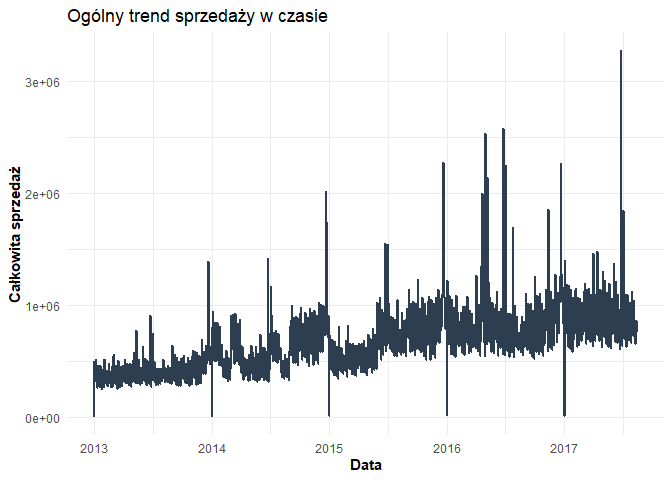
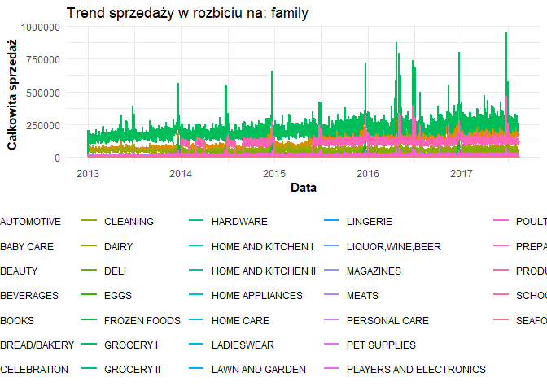
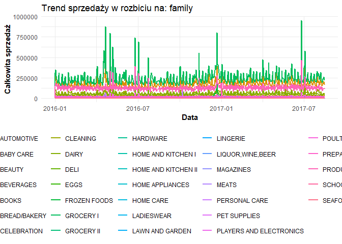

<!-- README.md is generated from README.Rmd. Please edit that file -->

## Poziom 1

Przygotowanie i walidacja danych pozwala na ujednolicenie struktury
danych z Kaggle oraz automatyczne wykrycie problemów z jakością szeregów
czasowych.

### 1. Wczytywanie danych: `load_sales_data()`

Funkcja automatycznie wczytuje i spaja trzy kluczowe zbiory danych z
Kaggle (`train.csv`, `stores.csv`, `holidays_events.csv`). Łączenie
odbywa się za pomocą relacji `left_join`, dzięki czemu dane sprzedażowe
zostają wzbogacone o dane sklepów (miasto, stan, typ) oraz informacje o
dniach świątecznych.

**Użycie:**

``` r
library(salesanalystR)

# Wczytanie danych z lokalnego folderu "dane" (zignorowanego w .gitignore)
dane_base <- load_sales_data("dane")

# Podgląd struktury tabeli
head(dane_base)
#> # A tibble: 6 × 15
#>      id date       store_nbr family sales onpromotion city  state type.x cluster
#>   <dbl> <date>         <dbl> <chr>  <dbl>       <dbl> <chr> <chr> <chr>    <dbl>
#> 1     0 2013-01-01         1 AUTOM…     0           0 Quito Pich… D           13
#> 2     1 2013-01-01         1 BABY …     0           0 Quito Pich… D           13
#> 3     2 2013-01-01         1 BEAUTY     0           0 Quito Pich… D           13
#> 4     3 2013-01-01         1 BEVER…     0           0 Quito Pich… D           13
#> 5     4 2013-01-01         1 BOOKS      0           0 Quito Pich… D           13
#> 6     5 2013-01-01         1 BREAD…     0           0 Quito Pich… D           13
#> # ℹ 5 more variables: type.y <chr>, locale <chr>, locale_name <chr>,
#> #   description <chr>, transferred <lgl>
```

### 2. Walidacja jakości danych: `validate_sales_ts()`

Funkcja przeprowadza automatyczny audyt techniczny i biznesowy
wczytanego zbioru danych. Zwraca szczegółowy raport w postaci listy oraz
wyświetla ostrzeżenia (warnings) w konsoli, jeśli wykryje
nieprawidłowości.

Audyt obejmuje:

- **Braki danych (NA):** Zlicza puste wartości w każdej kolumnie.
- **Duplikaty:** Sprawdza, czy dla tej samej daty, sklepu i kategorii
  produktu (`family`) nie pojawiają się podwójne wpisy.
- **Poprawność formatu dat:** Weryfikuje, czy kolumna z czasem została
  poprawnie rozpoznana jako obiekt klasy `Date`.
- **Zakres wartości:** Wykrywa błędne, ujemne wartości sprzedaży.
- **Częstotliwość szeregu:** Analizuje ciągłość osi czasu i wylicza, czy
  w danych nie brakuje całych dni.

**Użycie:**

``` r
# Uruchomienie audytu danych
raport_jakosci <- validate_sales_ts(dane_base)
#> Warning in validate_sales_ts(dane_base): Uwaga: Wykryto 42768 duplikatów (ta
#> sama data, sklep i kategoria).
#> Warning in validate_sales_ts(dane_base): Uwaga: Wykryto niespójną
#> częstotliwość. Brakuje danych dla 4 dni w szeregu czasowym.
#> Walidacja zakończona. Sprawdź zwróconą listę, aby zobaczyć pełny raport.

# Wyświetlenie pełnego raportu w konsoli
print(raport_jakosci)
#> $missing_values
#>          id        date   store_nbr      family       sales onpromotion 
#>           0           0           0           0           0           0 
#>        city       state      type.x     cluster      type.y      locale 
#>           0           0           0           0     2551824     2551824 
#> locale_name description transferred 
#>     2551824     2551824     2551824 
#> 
#> $duplicates
#> [1] 42768
#> 
#> $dates_valid
#> [1] TRUE
#> 
#> $negative_sales
#> [1] 0
#> 
#> $missing_dates_count
#> [1] 4
```

### 3. Czyszczenie danych: `clean_sales_ts()`

Funkcja przetwarza dane sprzedażowe przygotowując je do analizy i
modelowania. Usuwa braki danych, obsługuje duplikaty, umożliwia
sortowanie oraz opcjonalną agregację czasową (np. z dziennej na
tygodniową).

***Użycie:***

``` r
# Czyszczenie danych z domyślnym wypełnianiem braków zerami
dane_czyste <- clean_sales_ts(
  dane_base, 
  fill_na_method = "zero", 
  time_aggregation = NULL,
  sort_data = TRUE
)
#> Czyszczenie danych zakończone pomyślnie.
```

### 4. Obliczanie metryk biznesowych: `compute_sales_metrics()`

Funkcja wylicza kluczowe wskaźniki (m.in. sprzedaż całkowitą, przeciętną
sprzedaż, zmienność, udział promocji, średnią kroczącą) oraz szacuje
średni odstęp pomiędzy szczytami sprzedaży dla każdego produktu i
sklepu. Zwraca listę z wzbogaconym szeregiem czasowym i tabelą z
podsumowaniem wskaźników.

**Użycie:**

``` r
# Wyliczenie metryk ze średnią kroczącą z 7 dni
wyniki_metryk <- compute_sales_metrics(
  dane_czyste, 
  window_size = 7, 
  peak_threshold_percentile = 0.95
)
#> Metryki biznesowe zostały obliczone pomyślnie.

# Podgląd zagregowanych wskaźników
head(wyniki_metryk$metrics_summary)
#> # A tibble: 6 × 7
#>   store_nbr family total_sales average_sales sales_volatility_sd promo_share_pct
#>       <dbl> <chr>        <dbl>         <dbl>               <dbl>           <dbl>
#> 1         1 AUTOM…       5573          3.31                2.88            0.831
#> 2         1 BABY …          0          0                   0               0    
#> 3         1 BEAUTY       4143          2.46                2.04           13.0  
#> 4         1 BEVER…    2722710       1617.                789.             60.5  
#> 5         1 BOOKS         213          0.126               0.540           0    
#> 6         1 BREAD…     579547.       344.                124.             45.0  
#> # ℹ 1 more variable: avg_days_between_peaks <dbl>
```

## Poziom 2

Po oczyszczeniu danych i wyliczeniu podstawowych metryk, ten etap
pozwala na zgłębienie trendów poprzez wizualizację, analizę konkretnych
segmentów rynku oraz generowanie gotowych wniosków biznesowych dla
zarządu.

### 5. Wizualizacja trendów sprzedaży: `plot_sales_trends()`

Funkcja tworzy czytelne wykresy liniowe przy użyciu pakietu `ggplot2`.
Automatycznie agreguje dane, a także pozwala na opcjonalne rozbicie
wykresu według dowolnej zmiennej kategorycznej (np. kategorii produktu
lub numeru sklepu).

**Użycie:**

``` r
# Ogólny trend dla całego zbioru danych
wykres_ogolny <- plot_sales_trends(dane_czyste)
#> Warning: Using `size` aesthetic for lines was deprecated in ggplot2 3.4.0.
#> ℹ Please use `linewidth` instead.
#> ℹ The deprecated feature was likely used in the salesanalystR package.
#>   Please report the issue to the authors.
#> This warning is displayed once per session.
#> Call `lifecycle::last_lifecycle_warnings()` to see where this warning was
#> generated.
print(wykres_ogolny)
#> Warning in plot_theme(plot): The `plot_title` theme element is not defined in
#> the element hierarchy.
```



``` r

# Trend w rozbiciu na kategorie produktów (family)
wykres_kategorie <- plot_sales_trends(dane_czyste, group_var = "family")
print(wykres_kategorie)
#> Warning in plot_theme(plot): The `plot_title` theme element is not defined in
#> the element hierarchy.
```



### 6. Analiza wybranego segmentu: `sales_ts_logic()`

Funkcja wyższego rzędu (tzw. wrapper), która działa jak kompletny potok
analityczny dla wycinka danych. Pozwala odfiltrować dane po metadanych
sklepów (miasto, stan, typ) oraz datach, a następnie automatycznie
przelicza dla nich metryki biznesowe i generuje dedykowany wykres.

**Użycie:**

``` r
# Pełna analiza dla wybranych typów sklepów w mieście Quito od 2016 roku
analiza_quito <- sales_ts_logic(
  df = dane_czyste,
  cities = "Quito",
  types = c("A", "D"),
  start_date = "2016-01-01",
  group_by_var = "family"
)
#> Uruchamianie analizy dla 1054944 rekordów...
#> Metryki biznesowe zostały obliczone pomyślnie.

# Podgląd wygenerowanego wykresu i metryk
print(analiza_quito$plot)
#> Warning in plot_theme(plot): The `plot_title` theme element is not defined in
#> the element hierarchy.
```



``` r
head(analiza_quito$metrics$metrics_summary)
#> # A tibble: 6 × 7
#>   store_nbr family total_sales average_sales sales_volatility_sd promo_share_pct
#>       <dbl> <chr>        <dbl>         <dbl>               <dbl>           <dbl>
#> 1         1 AUTOM…       2580          4.36                3.12             2.36
#> 2         1 BABY …          0          0                   0                0   
#> 3         1 BEAUTY       1827          3.09                2.37            30.9 
#> 4         1 BEVER…    1264546       2136.                686.              98.0 
#> 5         1 BOOKS         213          0.360               0.863            0   
#> 6         1 BREAD…     228692.       386.                128.              79.7 
#> # ℹ 1 more variable: avg_days_between_peaks <dbl>
```

## Poziom 3

### 7. Podsumowanie dla zarządu: `create_management_summary()`

Funkcja wspierająca podejmowanie decyzji. Identyfikuje kluczowe
wskaźniki efektywności (KPI), takie jak najlepszy/najgorszy punkt
sprzedaży, najszybciej rosnąca kategoria czy największy spadek
procentowy, opierając się na porównaniu wybranego, ostatniego okresu z
poprzedzającym.

**Użycie:**

``` r
# Generowanie raportu biznesowego (porównanie ostatnich 30 dni do poprzednich 30 dni)
raport_zarzad <- create_management_summary(dane_czyste, period_days = 30)
#> Podsumowanie menedżerskie zostało wygenerowane.

# Wyciągnięcie konkretnych wniosków
print(raport_zarzad$best_store)
#> $store_nbr
#> [1] 44
#> 
#> $total_sales
#> [1] 63356137
print(raport_zarzad$fastest_growing_category)
#> $family
#> [1] "SCHOOL AND OFFICE SUPPLIES"
#> 
#> $absolute_growth
#> [1] 55113
#> 
#> $percentage_growth
#> [1] 2118.101
```

Ostatni etap to wykorzystanie historycznych danych sprzedażowych do
oszacowania przyszłego popytu.

### 8. Prognozowanie: `create_prognosis()`

Funkcja agreguje dane do poziomu całkowitej sprzedaży dziennej i trenuje
dwa niezależne modele szeregów czasowych: klasyczny ARIMA (z
automatycznym doborem optymalnych parametrów) oraz nowoczesny algorytm
Prophet (od Mety). Zwraca przejrzystą tabelę porównującą obie prognozy.

**Użycie:**

``` r
library(forecast)
#> Warning: pakiet 'forecast' został zbudowany w wersji R 4.5.2
library(prophet)
#> Warning: pakiet 'prophet' został zbudowany w wersji R 4.5.3
#> Ładowanie wymaganego pakietu: Rcpp
#> Ładowanie wymaganego pakietu: rlang
#> Warning: pakiet 'rlang' został zbudowany w wersji R 4.5.3

# Wygenerowanie prognozy na najbliższe 14 dni
wyniki_prognoz <- create_prognosis(dane_czyste, h = 14)
#> Trenowanie modelu auto.ARIMA...
#> Trenowanie modelu Prophet...
#> Generowanie prognoz zakończone sukcesem.

# Porównanie wyników ARIMA i Prophet
print(wyniki_prognoz$comparison_df)
#> # A tibble: 14 × 3
#>    date       arima_forecast prophet_forecast
#>    <date>              <dbl>            <dbl>
#>  1 2017-08-16        837045.          769939.
#>  2 2017-08-17        812690.          696141.
#>  3 2017-08-18        858635.          765073.
#>  4 2017-08-19        857674.          964372.
#>  5 2017-08-20        881918.         1037679.
#>  6 2017-08-21        836514.          809448.
#>  7 2017-08-22        821223.          766049.
#>  8 2017-08-23        842230.          793853.
#>  9 2017-08-24        842684.          723642.
#> 10 2017-08-25        869136.          795704.
#> 11 2017-08-26        854846.          997608.
#> 12 2017-08-27        865128.         1072937.
#> 13 2017-08-28        859108.          846104.
#> 14 2017-08-29        858793.          803457.
```
